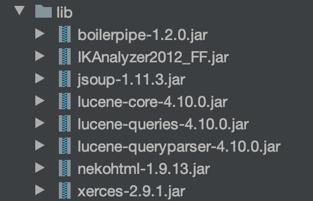
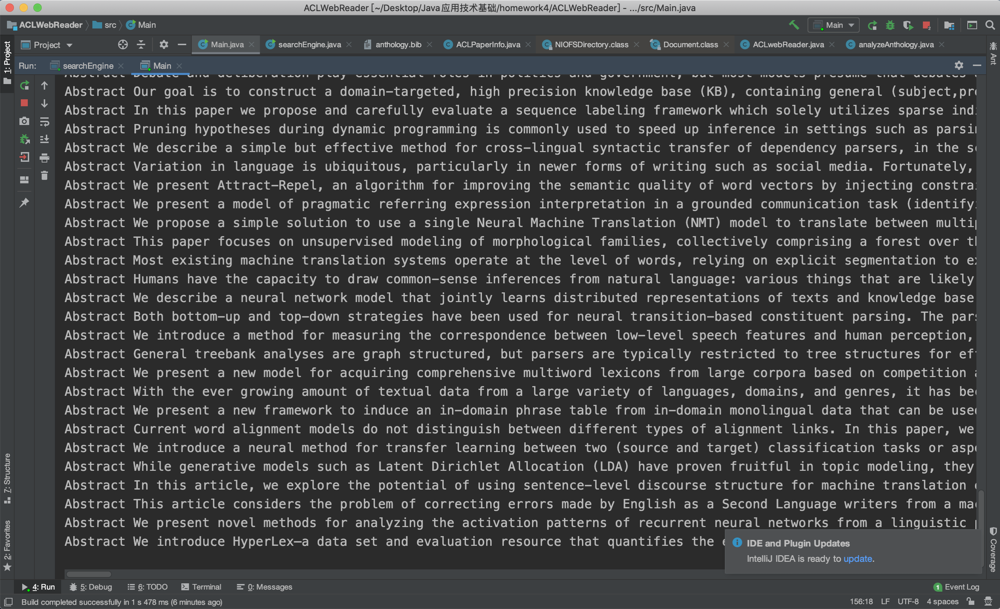
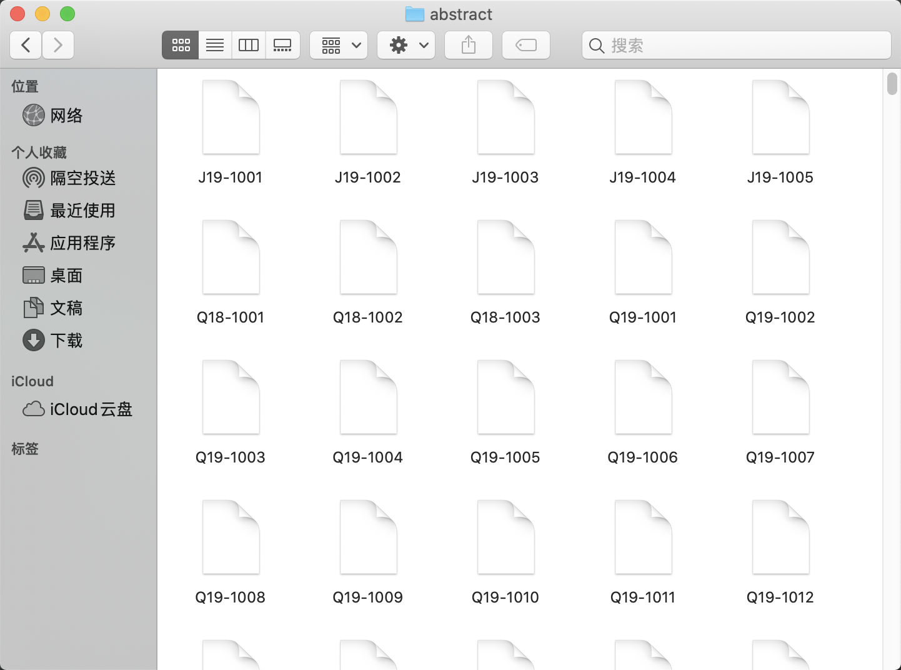
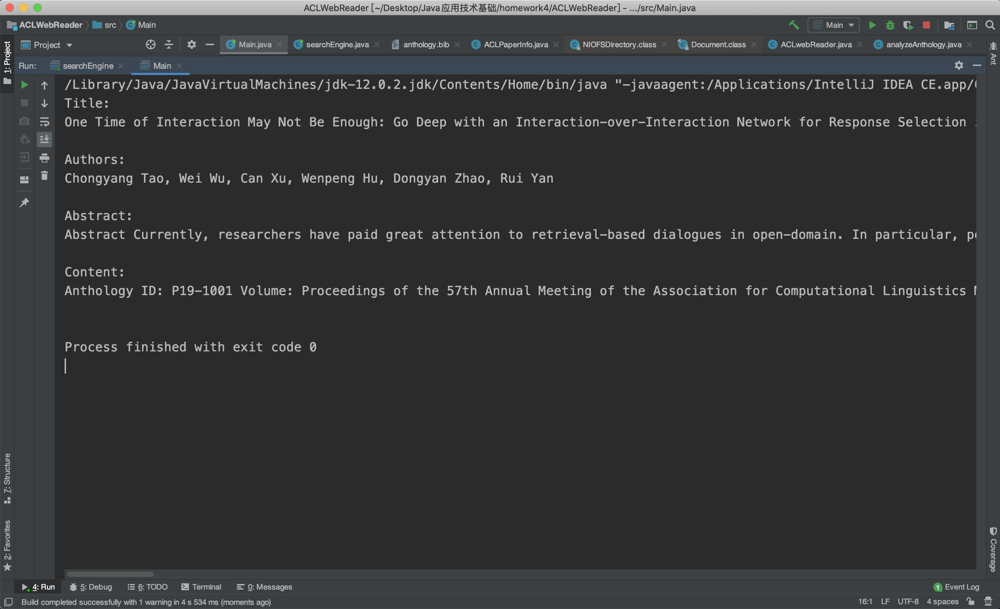
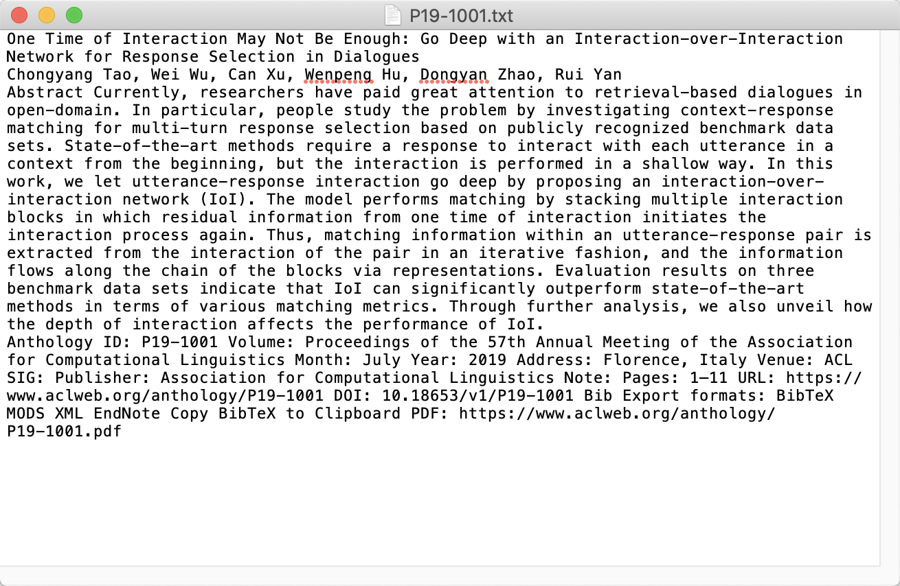
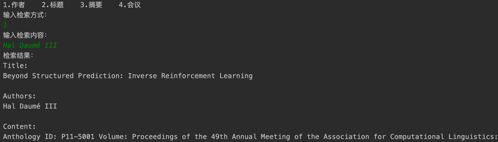
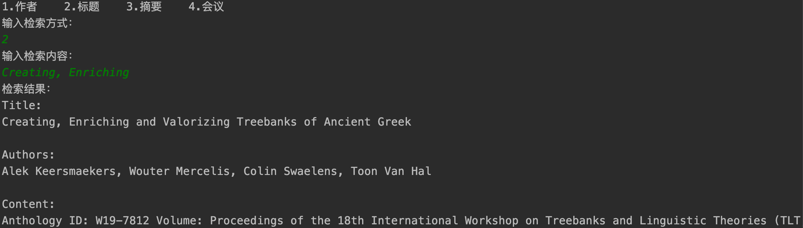
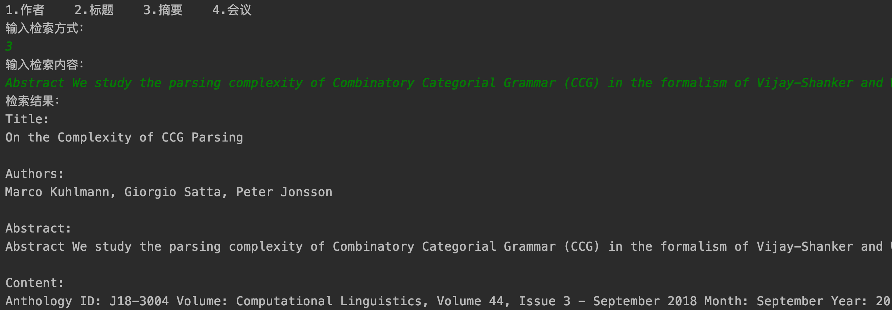
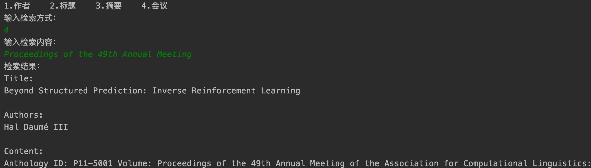

# 学术搜索引擎

# 1 目标

1. 写一个Web爬虫，爬取文献网站的网页(及 PDF文件); 

2. 解析网页内容，对内容进行结构化，并存储到文件中; 

3. 为内容建立索引;
4. 通过命令行进行内容检索，并展示内容列表 – 可通过作者、标题、摘要、会议来检索 。

# 2 总体设计

程序分为三个模块：解析anthology.bid文件、web爬虫爬取网站网页及PDF文件。

## 2.1 bid文件解析

解析anthology.bib文件，得到文献结构化信息，如标题、作者等。涉及到的类有：

- ACLPaperInfo.java
- analyzeAnthology.java

## 2.2 爬虫

使用jsoup库，通过网站URL爬取网页上的信息存储到本地文件，通过获得网页上的URL，下载论文到本地。涉及到的类有：

- ACLwebReader.java

## 2.3 索引

使用Lucene库，对本地文件和内存中的数据建立索引，通过建立的索引搜索相应的论文，可以通过标题、作者、摘要、会议搜索，并获得论文的URL，通过URL爬取详细信息打印到终端，并写入文件，存储到本地。涉及到的类有：

- searchEngine.java

## 2.4 依赖库



jsoup 是一款Java 的HTML解析器，可直接解析某个URL地址、HTML文本内容。它提供了一套非常省力的API，可通过DOM，CSS以及类似于jQuery的操作方法来取出和操作数据。

Lucene全文检索就是对文档中全部内容进行分词，然后对所有单词建立倒排索引的过程。利用Lucene对文本进行索引，并进行检索(输入检索词， 查询得到相关的问题(或课程)列表，并显示详细信息。 

# 3 详细设计

## 3.1 bid文件解析

构建一个ACLPaperInfo类，存放bid文件一条记录信息。可以从bid文件中获得以下几类信息：

```java
public String title;
public String author;
public String month;
public String year;
public String address;
public String publisher;
public String url;
public String pages;
public String name;
public String booktitle;
public int article;
```

构建一个analyzeAnthology类，通过解析字符串获得以上几类信息。

```java
String[] lines = papers[i].split(",\n");
String[] info = new String[9];
int a = 0;
//obtain the basic information
if (lines[0].startsWith("@article")) {
  a = 1;
}
for (int j = 1; j < lines.length; j++) {
  if (lines[j].startsWith("    title = ")) {
    info[0] = lines[j].substring(13, lines[j].length() - 1);
  } else if (lines[j].startsWith("    author = ")) {
    info[1] = lines[j].substring(14, lines[j].length() - 1);
  } else if (lines[j].startsWith("    month = ")) {
    info[2] = lines[j].substring(12, lines[j].length());
  } else if (lines[j].startsWith("    year = ")) {
    info[3] = lines[j].substring(12, lines[j].length() - 1);
  } else if (lines[j].startsWith("    address = ")) {
    info[4] = lines[j].substring(15, lines[j].length() - 1);
  } else if (lines[j].startsWith("    publisher = ")) {
    info[5] = lines[j].substring(17, lines[j].length() - 1);
  } else if (lines[j].startsWith("    url = ")) {
    info[6] = lines[j].substring(11, lines[j].length() - 1);
  } else if (lines[j].startsWith("    pages = ")) {
    info[7] = lines[j].substring(13, lines[j].length() - 1);
  } else if (lines[j].startsWith("    booktitle = ")) {
    info[8] = lines[j].substring(17, lines[j].length() - 1);
  }
```

在主函数中创建analyzeAnthology对象，解析文件，获得论文的URL等重要信息。

```java
analyzeAnthology a = new analyzeAnthology("src/anthology.bib");
```

## 3.2 信息抽取

解析anthology.bid文件，我们可以获得论文的URL、标题、作者、会议、地址等信息。通过论文的URL可以进行paper下载、网页爬取。

### 3.2.1 paper下载

首先用url建立connect。

```java
Document doc = Jsoup.connect(url)
  .userAgent("Mozilla/4.0 (compatible; MSIE 9.0; Windows NT 6.1; Trident/5.0)")
  .get();
```

用`select`方法获得网页上paper下载URL。

```java
 Elements hrefs = doc.select("a[href]");
```

调用`downLoadByUrl`方法下载论文。

```java
for (Element elem : hrefs) {
  if (elem.text().endsWith(".pdf")) {
    downLoadByUrl(elem.text(), fineName, savePath);
  }
}
```

在`downLoadByUrl`方法中捕获文件下载输入流，写到本地文件。

```java
public static void downLoadByUrl(String urlStr, String fileName, String savePath) throws IOException {
  URL url = new URL(urlStr);
  HttpURLConnection conn = (HttpURLConnection) url.openConnection();
  //avoid 403
  conn.setRequestProperty("User-Agent", "Mozilla/4.0 (compatible; MSIE 5.0; Windows NT; DigExt)");
  //get input
  InputStream inputStream = conn.getInputStream();
  byte[] getData = readInputStream(inputStream);
  //save the document
  File saveDir = new File(savePath);
  if (!saveDir.exists()) {
    saveDir.mkdir();
  }
  File file = new File(saveDir + File.separator + fileName);
  FileOutputStream fos = new FileOutputStream(file);
  fos.write(getData);
  if (fos != null) {
    fos.close();
  }
  if (inputStream != null) {
    inputStream.close();
  }
  System.out.println("info:" + url + " download success");
}
```

方法`readInputStream`将输入流写到本地文件中去。

```java
public static byte[] readInputStream(InputStream inputStream) throws IOException {
  byte[] buffer = new byte[1024];
  int len = 0;
  ByteArrayOutputStream bos = new ByteArrayOutputStream();
  while ((len = inputStream.read(buffer)) != -1) {
    bos.write(buffer, 0, len);
  }
  bos.close();
  return bos.toByteArray();
}
```

在主函数中调用downloadPapers方法，下载500篇论文。

```java
//download 500 papers
for (int i = 33501; i <= 34000; i++) {
  System.out.println(i);
  if (a.MyACLPaperInfo[i].url == null)
    continue;
  ACLwebReader.downloadPapers(a.MyACLPaperInfo[i].url, a.MyACLPaperInfo[i].name+".pdf", doadLoadPath);
}
```

### 3.2.2 网页爬取

通过URL建立connect，爬取网页上需要的信息。

```java
Document doc = Jsoup.connect(url)
  .userAgent("Mozilla/4.0 (compatible; MSIE 9.0; Windows NT 6.1; Trident/5.0)")
  .get();
String authors = doc.getElementsByClass("lead").text() + "\n";
String title = doc.getElementById("title").text() + "\n";
String abstracts = doc.getElementsByClass("card-body acl-abstract").text() + "\n";
String contents = doc.select("dl").text() + "\n";
```

在main函数中调用获得网站上的摘要：

```java
for (int i = 0; i < a.MyACLPaperInfo.length; i++) {
  if (a.MyACLPaperInfo[i].article == 1) {
    if (a.MyACLPaperInfo[i].url == null)
      continue;
    ACLwebReader.getAbstract(a.MyACLPaperInfo[i].url, a.MyACLPaperInfo[i].name, "abstract1");
  }
}
```

## 3.3 索引建立

创建索引，为标题、作者、摘要、会议信息创建相应的索引：`Title\Author\Booktitile\Abstract`。将论文的ID加入到字段的前方，以便与后续索引获得更多详细信息。

```java
public void createIndex() {
  File f = new File(indexFile);
  IndexWriter iwr = null;
  try {
    //create a directory to store index
    Directory dir = FSDirectory.open(f);
    //创建分词器
    Analyzer analyzer = new IKAnalyzer();
    //索引写出工具的配置对象
    IndexWriterConfig conf = new IndexWriterConfig(Version.LUCENE_4_10_0, analyzer);
    //创建索引的写出工具类。参数：索引的目录和配置信息
    iwr = new IndexWriter(dir, conf);
    File s = new File(sourceFile);
    String[] fileList = s.list();
    //创建摘要的索引
    for (int i = 0; i < fileList.length; i++) {
      if (fileList[i].equals(".DS_Store"))
        continue;
      File temp = new File(s, fileList[i]);
      if (!temp.isDirectory()) {
        Document doc = getDocument(temp.getAbsolutePath());
        //把文档交给IndexWriter
        iwr.addDocument(doc);
      }
    }
    for (int i = 0; i < a.MyACLPaperInfo.length; i++) {
      ACLPaperInfo temp = a.MyACLPaperInfo[i];
      Document doc = new Document();
      if (temp.title != null) {
        Field f1 = new TextField("Title", temp.name + ":" + temp.title, Field.Store.YES);
        doc.add(f1);
      }
      if (temp.author != null) {
        Field f2 = new TextField("Author", temp.name + ":" + temp.author, Field.Store.YES);
        doc.add(f2);
      }
      if (temp.booktitle != null) {
        Field f3 = new TextField("Booktitile", temp.name + ":" + temp.booktitle, Field.Store.YES);
        doc.add(f3);
      }
      iwr.addDocument(doc);
    }
  } catch (IOException ex) {
    ex.printStackTrace();
  }
  try {
    iwr.close();
  } catch (IOException ex) {
    ex.printStackTrace();
  }
}
```

## 3.4 查询

先选择需要搜索的内容的索引类别、需要索引的记录数量，然后通过关键词进行搜索，搜索的结果以ScoreDoc形式存储。具体实现搜索的函数如下，在searcher.search函数中指定待搜索的字符串和待搜索的记录条数。

```java
public ArrayList<String> searrch(String queryStr, String way) {
  ArrayList<String> results = new ArrayList<>();
  File f = new File(indexFile);
  try {
    IndexSearcher searcher = new IndexSearcher(DirectoryReader.open(FSDirectory.open(f)));
    Analyzer analyzer = new IKAnalyzer();
    QueryParser parser = new QueryParser(Version.LUCENE_4_10_0, way, analyzer);
    //输入lucene查询语句
    Query query = parser.parse(queryStr);
    //第二个参数指定需要显示的顶部记录的条数
    TopDocs hits = searcher.search(query, itemNum);
    //根据查询条件匹配出的记录总数
    for (ScoreDoc doc : hits.scoreDocs) {
      Document d = searcher.doc(doc.doc);
      results.add(d.get(way).split(":")[0]);
    }
  } catch (IOException | ParseException e) {
    e.printStackTrace();
  }
  return results;
}
```

在主函数中调用searrch获得索引的结果：第一个参数是待搜索内容；第二个字段是搜索类别：作者、名称、会议、摘要。

```java
 ArrayList<String> results = searchEngine.searrch(index, way);
```

在搜索到内容后，因为字段前面附有论文的ID。首先根据论文的ID获得论文的URL。

```java
String url = searchEngine.titile2url.get(d);
```

根据论文的URL，调用ACLwebReader的getInformation方法，爬取论文的网页数据，打印到终端，写入到本地文件。

```java
ACLwebReader.getInformation(url, d, "search");
```

# 4 测试与运行

## 4.1 文件结构说明

3170103240\_张佳瑶\_homework4

- ACLWebReader——Java程序

- papers——500篇论文
- abstract——论文摘要
- 3170103240\_张佳瑶\_homework4.pdf——报告

## 4.2 摘要爬取运行测试



文件结果



## 4.3 网页信息爬取测试



文件结果



## 4.4 索引运行测试

根据作者检索：



通过标题检索



通过摘要检索



通过会议检索



# 5 总结

通过jsoup工具可以爬取网页上的信息，通过lucene可以对字段创建索引。

# 6 引用

https://baike.baidu.com/item/jsoup/9012509?fr=aladdin

https://blog.csdn.net/sswqzx/article/details/84426127